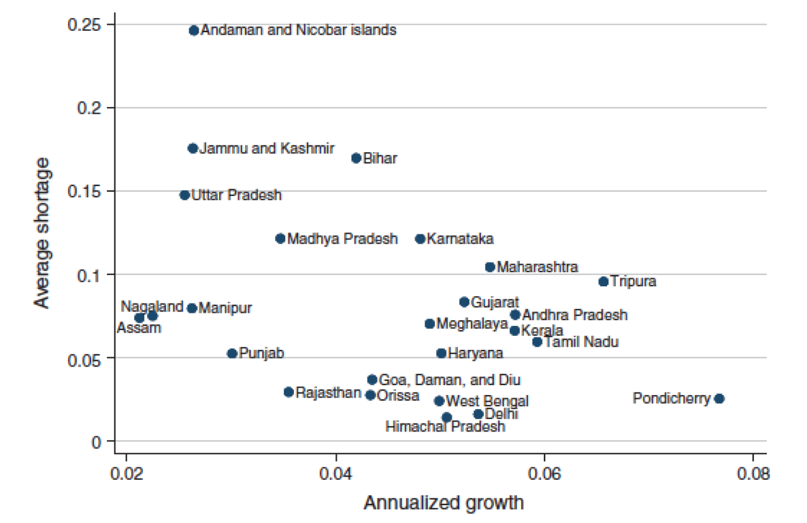
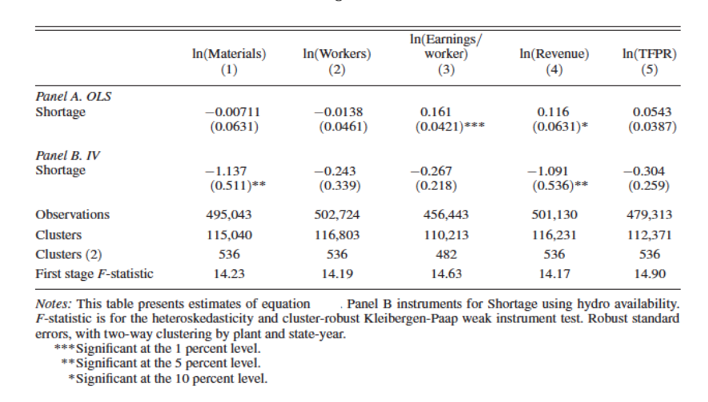
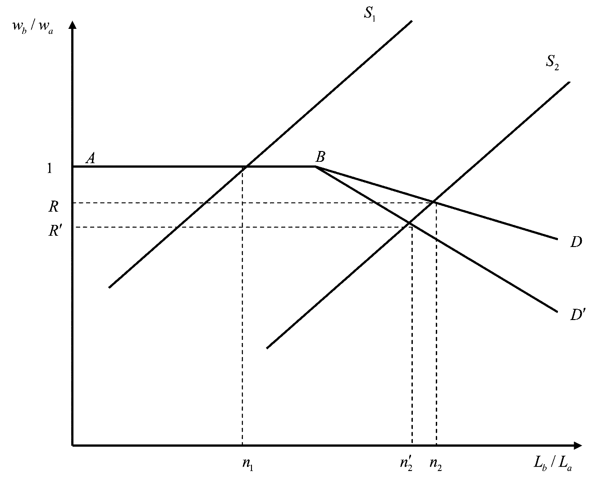

------------------------------------------------------------------------

# Part I — Electricity Shortages and Firm Performance

*Allcott, H., Collard-Wexler, A., and O'Connell, S.D. (2016). "How do electricity shortages affect industry? Evidence from India." American Economic Review*

------------------------------------------------------------------------

## 1. Aggregate evidence (1 point)

**In Figure 2, Allcott et al. (2016) plot average shortage** $S_{st}$ for each state against annualized per-capita GDP growth over 1992–2010. The correlation is clearly negative. Does this analysis indicate that shortages reduce GDP growth? Why or why not?

{width="70%"}

::: {.callout-caution collapse="true"}
## Answer

**No, this correlation does not establish causality.** Several sources of endogeneity prevent a causal interpretation:

1.  **Reverse causality**: Faster-growing states demand more electricity. If capacity cannot keep up with rapid demand growth, shortages are *higher* in fast-growing states — not because shortages cause slow growth, but because growth causes shortages. This would bias the observed correlation toward zero (or even reverse it), not necessarily produce the negative correlation, but the same logic means the correlation is not informative.

2.  **Omitted variables**: Geographic, institutional, and historical factors may simultaneously determine both a state's growth potential and its electricity infrastructure. For example, coastal states may attract more investment (higher growth) *and* have better energy infrastructure (lower shortages), generating a spurious negative correlation.

3.  **Selection / sorting**: Productive firms and mobile workers may sort toward low-shortage states, generating a cross-state correlation between shortages and growth that has nothing to do with the causal effect of blackouts on any individual firm.

To establish causality, one needs variation in shortages that is orthogonal to other determinants of growth — which is exactly what the IV strategy in Question 3 attempts to provide.
:::

------------------------------------------------------------------------

## 2. OLS with fixed effects (3 points)

Allcott et al. (2016) estimate by OLS: $$Y_{ist} = \rho S_{st} + \theta_t + \phi_i + \varepsilon_{ist} \tag{1}$$ where $\theta_t$ is a year fixed effect and $\phi_i$ is a firm fixed effect.

### 2a. Government capacity building (1 point)

**The Indian government has been building electricity capacity nationally, especially in years in which demand is high. Would this government action bias estimates of** $\rho$ in Equation (1)?

::: {.callout-caution collapse="true"}
## Answer

**No, this does not bias** $\hat\rho$, because the year fixed effect $\theta_t$ absorbs it.

The key phrase is "nationally": when the government responds to high aggregate demand by building capacity, the resulting reduction in shortages is common to all states in a given year. This is exactly the kind of national-year variation that $\theta_t$ controls for. After including year fixed effects, identification of $\rho$ relies on *within-year, across-state* variation in shortages — and that cross-state variation is not driven by the government's national capacity response.

If, however, the government targeted capacity-building at *specific states* with high demand (state-year variation), then $\phi_i + \theta_t$ would not fully absorb the endogeneity, and the estimate would be biased. The question specifies a national response, so the year FE is sufficient.
:::

### 2b. Firm sorting (1 point)

**Some firms are inherently more productive, and these firms might endogenously sort into states with low average blackout rates. Would this sorting bias estimates of** $\rho$?

::: {.callout-caution collapse="true"}
## Answer

**No, this does not bias** $\hat\rho$, because the firm fixed effect $\phi_i$ absorbs it.

Sorting based on time-invariant productivity is a time-invariant firm characteristic: a productive firm chose its location once, and that choice is captured by $\phi_i$. Since $\phi_i$ is firm-specific and constant over time, it absorbs both the firm's productivity level *and* the time-invariant shortage level of its state. Identification of $\rho$ then relies on *within-firm, over-time* variation: does the same firm's output fall in years when its state's shortage rises? This within-firm comparison is not contaminated by initial sorting.

This would fail only if firms were dynamically re-sorting into states in response to changing shortage levels — but the firm fixed effect cannot control for such time-varying sorting behavior.
:::

### 2c. Temperature (1 point)

**Temperature affects state-level energy demand (via air conditioning) and also firm output (via worker productivity). Would omitting state-specific temperature bias estimates of** $\rho$?

::: {.callout-caution collapse="true"}
## Answer

**Yes, omitting temperature biases** $\hat\rho$.

Temperature affects *both* the regressor $S_{st}$ (through its effect on electricity demand, which enters the numerator of the shortage formula) and the outcome $Y_{ist}$ (through its effect on worker productivity). This makes temperature a classic omitted variable that is correlated with both $S_{st}$ and $\varepsilon_{ist}$, violating the OLS exogeneity assumption.

The year FE $\theta_t$ only absorbs the *national* average temperature in each year, not state-level temperature deviations. The firm FE $\phi_i$ absorbs the *long-run average* temperature of each firm's location. But year-to-year *state-specific* temperature fluctuations — which simultaneously drive shortage levels and firm output — remain in the error term and bias $\hat\rho$.

This is precisely why the IV specification (Equation 3) includes state-year controls $W_{st}$ (which contain rainfall and weather variables): to remove this remaining source of confounding.
:::

------------------------------------------------------------------------

## 3. Instrumental variables strategy (2 points)

Allcott et al. (2016) use water inflows to hydroelectric reservoirs $Z_{st}$ to instrument for shortage $S_{st}$. The first stage is: $$S_{st} = \beta Z_{st} + \alpha_t + \phi_s + \varepsilon_{st} \tag{2}$$ and the IV regression is: $$Y_{ist} = \rho \hat S_{st} + \gamma W_{st} + \theta_t + \phi_i + \varepsilon_{ist} \tag{3}$$

### 3a. IV conditions and plausibility (2 points)

**Under what conditions does this IV strategy recover unbiased estimates of** $\rho$? Are these conditions likely to hold?

::: {.callout-caution collapse="true"}
## Answer

The IV strategy requires two conditions:

**1. Relevance**: $Z_{st}$ must be correlated with $S_{st}$ after conditioning on state and year fixed effects. This is credible: about 20% of India's electricity is generated from hydropower, so variation in water inflows directly affects available electricity supply, and hence shortage. The first-stage F-statistics reported in Figure 3 (around 14–15 across specifications) confirm a strong first stage.

**2. Exclusion restriction**: $Z_{st}$ should affect firm-level outcomes $Y_{ist}$ *only* through its effect on shortage $S_{st}$, conditional on the controls $W_{st}$, $\theta_t$, and $\phi_i$. This requires that water inflows have no direct effect on firm operations beyond their impact on electricity availability.

*Plausibility assessment*:

-   **Relevance**: likely satisfied, given the substantial share of hydropower in India's grid and the strong first-stage results.

-   **Exclusion restriction**: approximately satisfied, but not without risk. The main concern is that water inflows affect agriculture (irrigation), which could affect demand for manufactured goods and hence firm revenues through channels other than electricity. However, $W_{st}$ includes rainfall and weather controls that absorb the direct effects of weather on output, and the state and year FEs remove level differences. The residual variation in $Z_{st}$ after conditioning on $W_{st}$, $\phi_s$, and $\alpha_t$ should be close to orthogonal to firm outcomes through non-electricity channels.

Overall, the strategy is credible but relies on the controls $W_{st}$ being sufficient to close the agriculture-to-output channel.
:::

------------------------------------------------------------------------

## 4. Interpreting results (4 points)

{width="80%"}

### 4a. Revenue effect of a 1 pp increase in shortage (1 point)

**According to the IV estimates in Panel B, if shortages increase by 1 percentage point (e.g., from 0.10 to 0.11), by how much does firm-level annual revenue change?**

::: {.callout-caution collapse="true"}
## Answer

The IV coefficient on $\ln(\text{Revenue})$ in Panel B is $\hat\rho = -1.091$. The shortage variable $S_{st}$ is a share (between 0 and 1), so a 1 percentage point increase corresponds to $\Delta S = 0.01$.

$$\Delta \ln(\text{Revenue}) = -1.091 \times 0.01 = -0.01091$$

For small changes, $\Delta \ln(Y) \approx \Delta Y / Y$, so firm-level annual revenue falls by approximately **1.09%** in response to a 1 percentage point increase in shortage.
:::

### 4b. 95% Confidence interval for Panel B, column 4 (1 point)

**Compute a rough 95% confidence interval for the IV point estimate on log revenue.**

::: {.callout-caution collapse="true"}
## Answer

From Panel B, column 4: $\hat\rho = -1.091$ and $\text{SE} = 0.536$.

$$\text{95\% CI} = \hat\rho \pm 1.96 \times \text{SE} = -1.091 \pm 1.96 \times 0.536 = -1.091 \pm 1.051$$

$$\Rightarrow \quad (-2.142, \; -0.040)$$

The confidence interval excludes zero (consistent with the \*\* significance at 5%), and the range is wide, reflecting the imprecision typical of IV estimates with a single instrument and the noise introduced by using hydroelectric variation.
:::

### 4c. Explaining the OLS vs IV discrepancy (2 points)

**The OLS estimate (Panel A, column 4) is** $+0.116^*$ while the IV estimate (Panel B, column 4) is $-1.091^{**}$. What explains this difference?

::: {.callout-caution collapse="true"}
## Answer

The OLS and IV estimates differ dramatically in both sign and magnitude. Two complementary forces explain this:

**1. Endogeneity / reverse causality bias (positive bias in OLS)**

The shortage variable $S_{st} = (\text{Assessed Demand} - \text{Energy Available})/\text{Assessed Demand}$ depends on the government's assessment of counterfactual demand. High-output states have high electricity demand; the government, aware of this, invests more in capacity in high-growth states, pushing Energy Available up and $S_{st}$ down. This creates a spurious *negative* correlation between $S_{st}$ and $Y_{ist}$ beyond the causal effect — equivalently, a positive bias in $\hat\rho_{\text{OLS}}$. This can flip the estimated sign from negative (true effect) to positive (OLS).

**2. Attenuation bias from measurement error in** $S_{st}$ (further bias toward zero)

"Assessed Demand" is a government-computed counterfactual, not observed directly. It is likely measured with error. Classical measurement error in the regressor attenuates the OLS estimate toward zero. Combined with the positive endogeneity bias, this produces a small positive OLS estimate even though the true effect is large and negative.

**IV as a correction**

The instrument $Z_{st}$ (water inflows) is correlated with shortage but driven by exogenous weather, not by government capacity decisions or firm output. By using only the variation in $S_{st}$ that is due to hydrological shocks, the IV strips out both sources of bias and recovers the larger, negative causal effect.

This pattern — IV larger in magnitude than OLS — is consistent with measurement error being the dominant bias, as discussed in the course context of Acemoglu, Johnson, and Robinson (2001).
:::

------------------------------------------------------------------------

# Part II — Social Interactions

------------------------------------------------------------------------

## 1. Discrimination (3 points)

The Becker model of taste-based discrimination is represented in Figure 1, where $b$ is the minority group and $a$ is the majority group, $L$ is the number of workers, and $w$ is the wage.

{width="75%"}

### 1.1 Why does marginal prejudice matter more than average prejudice? (1 point)

::: {.callout-caution collapse="true"}
## Answer

In the Becker model, an employer with taste parameter $d > 0$ acts as if the effective wage of a minority worker is $w_b + d$: she will hire minority workers only if $w_a - w_b \geq d$.

**The equilibrium wage gap is determined by the marginal employer**: the least-prejudiced employer who is still *not* hiring minority workers. Non-discriminating employers ($d = 0$) or mildly prejudiced ones ($d$ small) will hire minority workers even at near-equal wages. As more minority workers enter the labor market, they are absorbed first by non-discriminating employers. The wage gap only falls below zero (i.e., $w_b < w_a$) when minority labor supply exhausts non-discriminating employer demand — and the gap is then set by the marginal discriminator at that threshold.

**Figure 1**: The flat segment from $A$ to $B$ (wage ratio = 1) corresponds to the range of minority employment that non-discriminating employers absorb. Once the minority labor supply exceeds this threshold (above $n_1$), the demand curve slopes downward — discrimination at the margin depresses the relative wage.

Average prejudice is irrelevant as long as there are enough non-prejudiced employers to absorb the entire minority labor supply. What drives the wage gap is the distribution in the *right tail* of the prejudice distribution among employers who actually compete to hire minority workers — i.e., the prejudice of the employer at the margin.

This is the core testable implication of the model, verified empirically by Charles & Guryan (2008).
:::

### 1.2 Is taste-based discrimination compatible with a competitive environment? (1 point)

::: {.callout-caution collapse="true"}
## Answer

**In a competitive product market with free entry or constant returns to scale, taste-based employer discrimination is not compatible in the long run**.

Discriminating employers face higher effective labor costs: either they pay a premium to hire majority workers, or they forego productive minority workers. Non-discriminating firms face lower costs. In a competitive equilibrium, non-discriminating firms earn higher profits and can expand, taking minority workers away from discriminating firms. Over time, discriminating firms are either driven out of business or forced to abandon discrimination.

Formally, discriminating employers must fund the cost of their distaste out of their own pockets. Under free entry, zero-profit conditions eliminate firms with such inefficiencies.

**However, discrimination can persist in competitive markets under three alternative mechanisms**:

1.  **Customer discrimination**: if majority consumers dislike being served by minority workers, firms employing minority workers face lower revenue. This is not arbitraged away by competition since individual consumers cannot offset each other's prejudice.
2.  **Co-worker discrimination**: if majority workers demand a compensating wage differential to work alongside minority workers, firms integrating the workforce face higher payroll costs — independent of employer prejudice.
3.  **Non-competitive markets**: with barriers to entry or monopsony power, discriminating firms can survive despite the efficiency loss.
:::

### 1.3 Pros and cons of sending fictitious resumes (1 point)

::: {.callout-caution collapse="true"}
## Answer

**Pros**

-   **Causal identification**: random assignment of names ensures that any difference in callback rates reflects discrimination rather than productivity differences between groups. This is the gold standard for detecting discrimination at the hiring stage.
-   **Internal validity**: the resume content (experience, skills) is held constant across groups, eliminating confounding from observable productivity.
-   **Systematic measurement**: audits produce quantitative estimates of the discrimination gap (e.g., White names received 50% more callbacks) that are replicable and comparable across markets.
-   **Legal standing**: U.S. courts accept correspondence study evidence as grounds for discrimination claims.

**Cons**

-   **Limited outcome**: callback rates capture only one stage of hiring. Employment, wages, promotion, and working conditions — potentially more economically important forms of discrimination — are not measured.
-   **External validity**: very distinctive names (e.g., Latoya vs. Meredith) may not represent the average applicant from either group, and results may not generalize to other markets, occupations, or countries.
-   **Heckman critique (internal validity)**: if the *unobservable* characteristics of minority and majority applicants have different variances, the audit may detect statistical discrimination rather than taste-based discrimination. Specifically, if employers have more noise in evaluating minority candidates ($\sigma^2_{\iota,b} > \sigma^2_{\iota,a}$), minority applicants with low observable qualifications receive more callbacks (because the high-variance signal can still be above threshold), while high-qualification minority candidates receive fewer — making the *average* gap ambiguous even with equal group means.
-   **Endogenous observables**: if minority applicants invest less in observable skills because they anticipate discrimination, the study conflates the detection of discrimination with its downstream effects on human capital investment.
:::

------------------------------------------------------------------------

## 2. Segregation (3 points)

There are two types of households $j = H, L$ and two neighborhoods $i = a, b$ of equal size $N$, with each group also of size $N$. Valuation depends on the social environment $s_i = H_i/N$ (share of rich households in neighborhood $i$): $$V_H(s_i) = \ln(1 + s_i), \qquad V_L(s_i) = \ln(1 + 3s_i)$$ Prices are set by competitive bidding.

### 2.1 Why should valuation increase with the share of H households? (1 point)

::: {.callout-caution collapse="true"}
## Answer

Several mechanisms in the real world justify $V_j'(s_i) > 0$ — the preference for neighborhoods with a higher share of rich households:

1.  **Local public goods and services**: wealthier residents contribute more to local tax revenue, supporting better-funded schools, parks, and public infrastructure. These amenities benefit all residents of the neighborhood.

2.  **Property maintenance and neighborhood aesthetics**: higher-income households tend to invest more in maintaining their properties, raising neighborhood quality and protecting property values.

3.  **Social network effects**: rich neighbors may provide access to professional networks, job referrals, and economic information that raise the economic prospects of all residents.

4.  **Crime and safety**: neighborhoods with higher-income households typically have lower crime rates (partly through private security investments and partly through lower local poverty), generating positive spillovers for all residents.

5.  **Matching externalities**: living near high-income households may affect educational aspirations and peer effects for children, raising long-term returns for all families in the area.

Note that $V_L'(s_i) = 3/(1+3s_i) > V_H'(s_i) = 1/(1+s_i)$ for all $s_i$: low-type households value the social environment *more* than high-type households at every level of $s_i$.
:::

### 2.2 Why is full integration an equilibrium in this model? (1 point)

::: {.callout-caution collapse="true"}
## Answer

At full integration, both neighborhoods have the same composition: $s_a = s_b = 1/2$. The neighborhoods are identical, so competitive bidding implies equal prices: $P_a = P_b$.

**Neither type has an incentive to move**:

-   An $H$ household in neighborhood $a$ obtains $V_H(1/2) - P_a = \ln(3/2) - P_a$. Moving to $b$ gives $V_H(1/2) - P_b = \ln(3/2) - P_b$. Since $P_a = P_b$, the household is indifferent — no gain from moving.

-   An $L$ household in neighborhood $a$ obtains $V_L(1/2) - P_a = \ln(5/2) - P_a$. Moving to $b$ gives $V_L(1/2) - P_b = \ln(5/2) - P_b$. Again indifferent.

Since no individual household gains from switching neighborhoods, and prices equalize utilities across both groups, full integration satisfies the definition of a competitive equilibrium: no profitable deviation exists.
:::

### 2.3 Is full integration a stable equilibrium? What about full segregation? (1 point)

::: {.callout-caution collapse="true"}
## Answer

**Full integration is stable.**

Consider a small perturbation: one $H$ household moves from $b$ to $a$ (and one $L$ from $a$ to $b$), so $s_a = 1/2 + \varepsilon > s_b = 1/2 - \varepsilon$. The price differential from competitive bidding is: $$P_a - P_b = \max\{V_H(s_a) - V_H(s_b),\; V_L(s_a) - V_L(s_b)\}$$

Since $V_L'(s) > V_H'(s)$ for all $s$ (shown above: $3(1+s) > 1+3s$ always holds), we have: $$V_L(s_a) - V_L(s_b) > V_H(s_a) - V_H(s_b)$$

$L$ types outbid $H$ types: the price premium for $a$ is set by $L$'s valuation. But then $H$ types face $P_a - P_b = V_L(s_a) - V_L(s_b) > V_H(s_a) - V_H(s_b)$, so $H$ types cannot profitably move to $a$. Moreover, the $H$ that moved to $a$ prefers to return to $b$ (cheaper relative to $H$'s valuation), restoring integration.

The perturbation does not self-reinforce: integration **is** a stable equilibrium.

**Full segregation is unstable.**

Consider full segregation with all $H$ in $a$ ($s_a = 1$) and all $L$ in $b$ ($s_b = 0$). The price premium is: $$P_a - P_b = V_L(1) - V_L(0) = \ln(4)$$

$H$ households in $a$ only value the premium at $V_H(1) - V_H(0) = \ln(2) < \ln(4)$. The neighborhood is overpriced relative to their valuation, so $H$ types prefer to move to $b$. But $b$ has $s_b = 0$ initially — as $H$ types leave $a$ and move to $b$, $s_b$ rises and $s_a$ falls, and the neighborhood composition moves away from full segregation.

By symmetric reasoning, the other segregated configuration ($s_a = 0$, $s_b = 1$) is also unstable: $H$ types prefer the cheaper neighborhood $a$ (even though it is $L$-rich) because the price premium for $b$ ($\ln 4$ in favor of $b$) exceeds their valuation premium ($\ln 2$).
:::

------------------------------------------------------------------------

## 3. Intertemporal consumption (2 points)

Utility from consumption is $u(c) = \ln(2c + Z)$ with $Z \in \mathbb{R}$. People live for two periods with initial endowments $A$, discount factor $\beta$, and interest rate $r$. The price of the consumption good is normalized to 1.

### 3.1 Does consumption in period 1 increase with $r$? (1 point)

::: {.callout-caution collapse="true"}
## Answer

**It depends on the sign of** $Z$: $c_1$ increases with $r$ if and only if $Z < 0$.

**Derivation.** The consumer maximizes $u(c_1) + \beta u(c_2)$ subject to $c_2 = (1+r)(A - c_1)$.

First-order conditions: $$u'(c_1) = \lambda \;\Rightarrow\; \frac{2}{2c_1 + Z} = \lambda$$ $$\beta u'(c_2) = \frac{\lambda}{1+r} \;\Rightarrow\; c_2 = \frac{\beta(1+r)}{\lambda} - \frac{Z}{2}$$

This gives $c_1 = \frac{1}{\lambda} - \frac{Z}{2}$ and $c_2 = \frac{\beta(1+r)}{\lambda} - \frac{Z}{2}$. Substituting into the budget constraint $A = c_1 + c_2/(1+r)$:

$$A = \frac{1+\beta}{\lambda} - \frac{Z(2+r)}{2(1+r)} \;\Rightarrow\; \frac{1}{\lambda} = \frac{A + \frac{Z(2+r)}{2(1+r)}}{1+\beta}$$

Therefore: $$c_1 = \frac{1}{\lambda} - \frac{Z}{2} = \frac{A}{1+\beta} + \frac{Z}{2(1+\beta)}\left[\frac{2+r}{1+r} - (1+\beta)\right]$$

Differentiating with respect to $r$: $$\frac{\partial c_1}{\partial r} = \frac{Z}{2(1+\beta)} \cdot \frac{\partial}{\partial r}\!\left[\frac{2+r}{1+r}\right] = \frac{Z}{2(1+\beta)} \cdot \frac{-1}{(1+r)^2}$$

$$\Rightarrow \quad \frac{\partial c_1}{\partial r} > 0 \iff Z < 0$$

**Intuition.** A rise in $r$ has two effects on period-1 consumption:

-   **Substitution effect**: future consumption becomes cheaper relative to today → consume *less* today (negative effect).
-   **Income effect**: a higher return on savings makes the consumer wealthier if she is a net saver → consume *more* today (positive effect).

For the pure log utility $u(c) = \ln(c)$ (i.e., $Z = 0$), these two effects exactly cancel. Adding $Z < 0$ makes the effective bliss point negative, increasing the elasticity of substitution and allowing the income effect to dominate.
:::

### 3.2 Will she give her kid some money? (1 point)

::: {.callout-caution collapse="true"}
## Answer

**Yes, if and only if she is altruistic (**$a > 0$), and under mild conditions on the kid's utility, any positive altruism implies a strictly positive transfer.

**Setup.** The parent's total utility is $V_p = u(c_1) + \beta u(c_2) + \beta a V_k(c_k)$, where $a \geq 0$ is the altruism parameter and $c_k = B$ is the kid's consumption (funded entirely by the bequest). The period-2 budget constraint becomes $c_2 + B = (1+r)(A - c_1)$.

**First-order condition for bequests**: $$a V_k'(B^*) = u'(c_2^*)$$

This condition holds at an interior optimum ($B^* > 0$). At $B = 0$, the condition for a corner solution to be rejected is: $$a V_k'(0) > u'(c_2^*|_{B=0})$$
:::

------------------------------------------------------------------------

## 4. Crime (2 points)

Legal income is $Y$, criminal income is $\bar Y > Y$. Criminals are caught with probability $\pi$, in which case they receive only $\bar Y - \xi < Y$. Utility from income $Y$ is $U(Y)$ with $U'(Y) > 0$.

### 4.1 $\pi$ and $\xi$ as deterrents (1 point)

**Show that both** $\pi$ and $\xi$ act as deterrents. What do $\pi$ and $\xi$ represent in the real world?

::: {.callout-caution collapse="true"}
## Answer

**Setting up the decision.** An individual commits a crime if and only if expected utility from crime exceeds utility from legal work: $$\pi U(\bar Y - \xi) + (1-\pi)U(\bar Y) > U(Y)$$

**Deterrence from** $\pi$ (probability of detection): $$\frac{\partial}{\partial \pi}\left[\pi U(\bar Y - \xi) + (1-\pi)U(\bar Y)\right] = U(\bar Y - \xi) - U(\bar Y) < 0$$ since $\bar Y - \xi < \bar Y$ and $U' > 0$. A higher probability of being caught reduces the expected utility of crime → deterrent effect. $\square$

**Deterrence from** $\xi$ (severity of punishment): $$\frac{\partial}{\partial \xi}\left[\pi U(\bar Y - \xi) + (1-\pi)U(\bar Y)\right] = -\pi U'(\bar Y - \xi) < 0$$ since $\pi > 0$ and $U' > 0$. A harsher sanction lowers the payoff when caught → deterrent effect. $\square$

**In the real world**: - $\pi$ represents the probability of detection and conviction: determined by police presence and quality, surveillance technology, prosecution efficiency, and the difficulty of committing the crime undetected. - $\xi$ represents the severity of the sanction when convicted: fines, length of imprisonment, community service, loss of civil rights, reputational damage, etc.

Both are instruments available to policymakers, but they have different costs: increasing $\pi$ requires resources (police, courts), while increasing $\xi$ is cheaper to implement but may raise ethical concerns about proportionality.
:::

### 4.2 Why does risk attitude determine which deterrent is more effective? (1 point)

::: {.callout-caution collapse="true"}
## Answer

**The relative effectiveness of** $\pi$ and $\xi$ depends on the curvature of $U(\cdot)$ — i.e., the criminal's attitude toward risk.

The relative elasticities are: $$\varepsilon_{U,\pi} = \frac{U(\bar Y) - U(\bar Y - \xi)}{U/\pi} \qquad \text{and} \qquad \varepsilon_{U,\xi} = \frac{\pi U'(\bar Y - \xi)}{U/\xi}$$

**Risk-averse criminals** ($U'' < 0$): the marginal utility of income is high at low levels. Getting caught and receiving only $\bar Y - \xi$ is particularly painful because it falls in the region of high marginal utility. An increase in $\xi$ therefore has a large effect on expected utility. Conversely, a change in $\pi$ shifts probability weight from the good outcome $\bar Y$ to the bad outcome $\bar Y - \xi$, but a risk-averse agent places less weight on the good outcome. → $\xi$ is the more effective deterrent for risk-averse criminals.

**Risk-loving criminals** ($U'' > 0$): the marginal utility of income is high at high levels. The agent places strong weight on the possibility of getting away ($\bar Y$). A higher $\pi$ reduces the probability of this good outcome, which is what the agent cares most about. An increase in $\xi$ only affects the bad outcome, which the risk-loving agent discounts. → $\pi$ is the more effective deterrent for risk-loving criminals.

**Risk-neutral criminals** ($U'' = 0$, linear $U$): only the expected sanction $\pi \xi$ matters. Both instruments are equally effective through the product $\pi\xi$.
:::