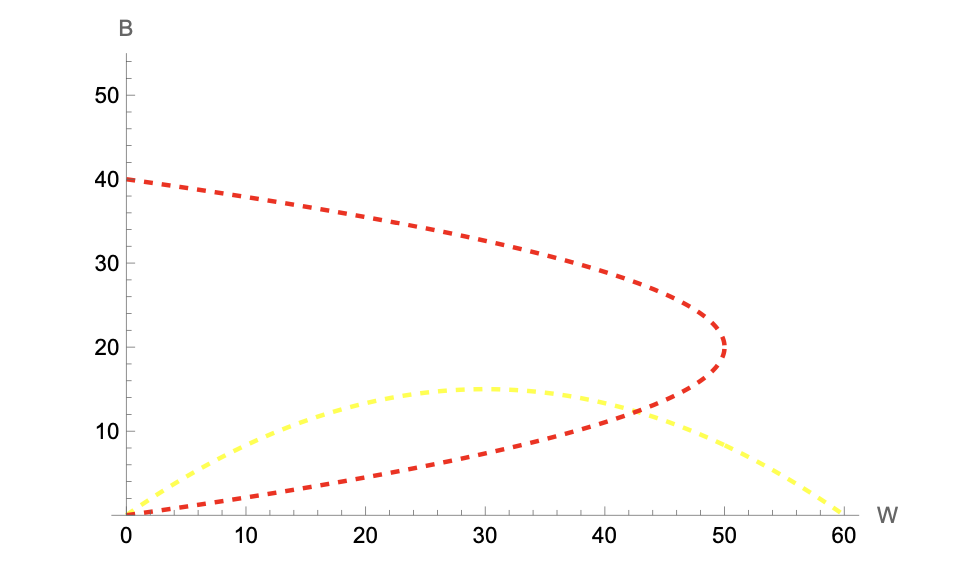
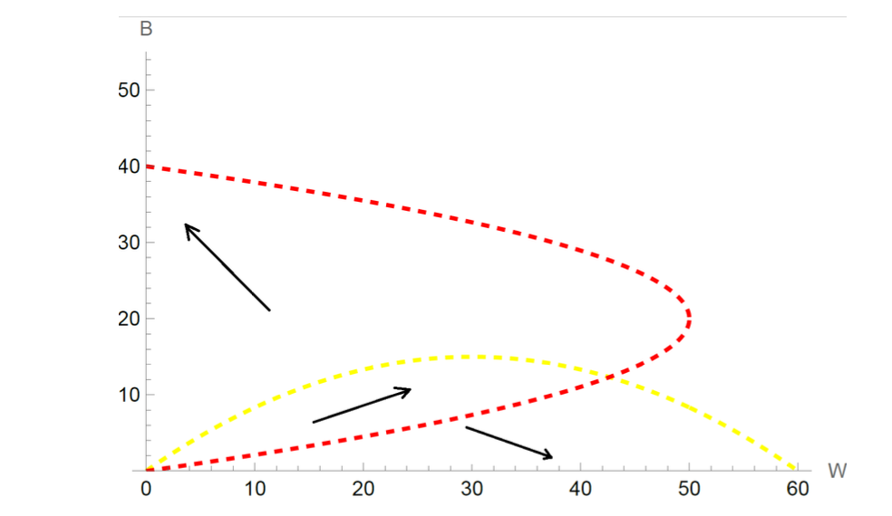
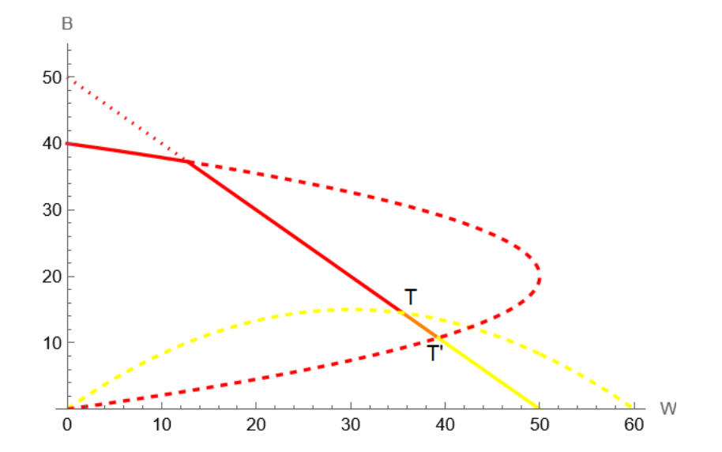
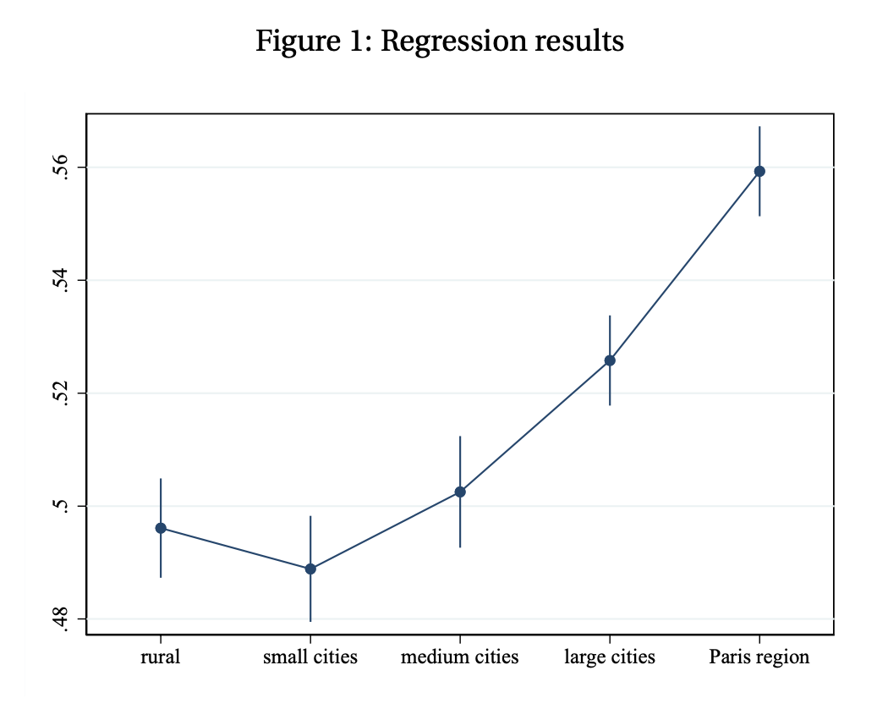

This quiz covers the three main topics of Part 2: the social multiplier model, the tipping model of segregation, and the empirical analysis of assortative matching by education.

------------------------------------------------------------------------

## 1. Short Questions — Social Multiplier (6 points)

Maurin and Moschion (2009) study the impact of the labor force participation of close-by mothers on mothers' own labor force participation.

### 1.1 Social multiplier mechanism

**Using the social multiplier model, explain why one may expect a positive impact of neighboring mothers' inactivity on a mother's own inactivity, even if having more inactive mothers around may lower individual utility. (2 points)**

::: {.callout-caution collapse="true"}
## Answer

Taking care of one's kids may be more pleasant if other people around are also taking care of their kids (e.g., time at the playground is more enjoyable with companions). In the social multiplier framework:

-   Mothers maximize $U = U(x, y, S)$ subject to $I = px + y$, where $x$ is time spent with children (cost $p$), $y$ is numeraire consumption, and $S = \bar{x}$ is the average time spent with children by neighboring mothers, taken as given.
-   The first-order condition is: $$\frac{U_x}{U_y} = p \iff U_x = pU_y$$
-   Using total differentiation and second-order conditions, the comparative static gives: $$\frac{dx^*}{dS} > 0 \iff U_{xS} > pU_{yS}$$

What matters is how social capital $S$ changes the *relative* marginal utility of inactivity versus consumption. If having more inactive neighbors increases the marginal utility of own inactivity more than the marginal utility of consumption, then $dx^*/dS > 0$.

Importantly, this result does **not** require $U_S > 0$: individual utility may fall when inactive mothers cluster nearby, yet the social multiplier effect on behavior can still be positive.
:::

### 1.2 Endogeneity of neighborhood choice

**Explain why the simple correlation between the average labor force participation of close-by mothers and a mother's own probability of participating in the labor force may not be informative. (2 points)**

::: {.callout-caution collapse="true"}
## Answer

A positive correlation does not establish causality because other factors may jointly determine both individual and average neighbor participation, in particular through endogenous spatial sorting:

1.  **Observable sorting**: inactive mothers tend to live in poorer households and may only afford cheap neighborhoods. Controlling for local housing prices, the correlation might still be meaningful — but this requires observing all relevant prices.

2.  **Unobservable sorting**: very local amenities, unobserved tastes may simultaneously attract inactive mothers and be unobserved by the econometrician. Controlling for observables is then insufficient.

3.  **Reverse causality**: the social multiplier effect itself may shape location decisions: inactive mothers may seek out neighborhoods where others are inactive.
:::

### 1.3 Instrumental variables strategy

**What is the empirical strategy used by the authors to address the previous problem? Does it resolve all concerns? (2 points)**

::: {.callout-caution collapse="true"}
## Answer

**Strategy.** Maurin and Moschion (2009) exploit the fact that mothers whose first two children are of the same gender are significantly more likely to have a third child, which lowers labor force participation. The instrument is the gender mix of the first two children of neighboring mothers:

-   **Relevance**: the gender mix of neighbors' first two children strongly predicts neighbors' participation rate (via the probability of having a third child).
-   **Exclusion restriction**: the gender mix of neighbors' children should not directly affect a mother's own participation decision.

**Remaining concerns.** The IV strategy does not fully resolve all endogeneity issues:

-   **Alternative causal mechanisms**: having more inactive neighbors may affect individual employability through referral networks (fewer employed contacts → fewer job leads) or through peer effects on individual productivity. These are causal pathways distinct from preference complementarity but not ruled out by the instrument.
-   The same IV (neighbors' gender mix) would also capture any effect operating through labor market networks, making it impossible to distinguish pure preference effects from labor market channels.
:::

------------------------------------------------------------------------

## 2. Problem — Neighborhood Tipping (9 points)

We consider one neighborhood with no capacity constraint. Potential residents are perfectly mobile and are either "Black" (B) or "White" (W). There are 61 Whites $i \in [\![0, 60]\!]$ and 41 Blacks $j \in [\![0, 40]\!]$. Individuals' utility depends on the maximum ratio of out-group neighbors to in-group residents they tolerate. This tolerance ratio is uniformly distributed: $T^W_i = 1 - i/60$ for Whites and $T^B_j = 5 - j/8$ for Blacks. The least tolerant individuals always leave first and there is no anticipatory behavior.

### 2.1 Comparative tolerance

**Who is more tolerant in this framework? Explain with examples. (2 points)**

::: {.callout-caution collapse="true"}
## Answer

More tolerant individuals have **lower** values of $i$ or $j$:

-   White $i = 0$: tolerates a ratio of up to 1 Black per White (equal numbers).

-   White $i = 30$: tolerates at most 0.5 Blacks per White (twice as many Whites as Blacks).

-   White $i = 60$: only tolerates an all-White neighborhood ($T^W_{60} = 0$).

-   Black $j = 0$: tolerates up to 5 Whites per Black.

-   Black $j = 40$: tolerates up to $5 - 40/8 = 0$ Whites ($T^B_{40} = 0$).

**Whites**: tolerance is uniformly distributed on $[0, 1]$. **Blacks**: tolerance is uniformly distributed on $[0, 5]$. Blacks are therefore systematically more tolerant as a group.
:::

### 2.2 Response functions

**Justify the construction of the response functions that solve the location problem. (1 point)**

::: {.callout-caution collapse="true"}
## Answer

By definition, Whites tolerate the neighborhood as long as the ratio of Blacks to Whites does not exceed their tolerance level: $T^W = B/W$. Blacks tolerate it as long as $T^B = W/B$.

Given the uniform distribution of tolerance ratios, exactly $i$ Whites have $T^W_i \leq T^W$, so the number of Whites in the neighborhood equals the index $i$ at which $T^W_i = B/W$. Substituting $T^W_i = 1 - W/60$: $$T^W = 1 - \frac{W}{60} = \frac{B}{W} \implies B(W) = W\!\left(1 - \frac{W}{60}\right)$$

Similarly for Blacks, $T^B_j = 5 - B/8 = W/B$: $$W(B) = B\!\left(5 - \frac{B}{8}\right)$$

These response functions give the maximum number of out-group residents accepted in a neighborhood already containing a given number of in-group residents.

*Note.* In the exact discrete model, the $B$ Blacks present are indexed $j = 0, \ldots, B-1$, so the marginal one has tolerance $5 - (B-1)/8$ rather than $5 - B/8$. The correct discrete response function is therefore $W(B) = B(41-B)/8$, and similarly $B(W) = W(61-W)/60$ for Whites.
:::

### 2.3 Graphical resolution

**Draw the response functions in the** $(W, B)$ plane and find numerical approximations of the equilibrium solutions. (1 point)

::: {.callout-caution collapse="true"}
## Answer

Both response functions are hump-shaped: a larger in-group mechanically accommodates more out-group residents, but as the in-group grows, the least tolerant members enter and the curve eventually falls.

The interior equilibrium solves the system: $$\begin{cases} B = W(1 - W/60) \\ W = B(5 - B/8) \end{cases}$$

Substituting the first equation into the second and solving numerically yields two solutions:

-   $(W, B) = (0, 0)$ — the empty neighborhood.
-   $(W, B) \approx (43, 12)$ — a mixed interior solution.

*(*There are two additional equilibra**:** $(60, 0)$ and $(0, 40)$, which are the full-segregation boundary points)

{width="70%"}
:::

### 2.4 Population dynamics

**Use the graph to describe the possible population dynamics. (2 points)**

::: {.callout-caution collapse="true"}
## Answer

The arrows on the phase diagram summarize the dynamics. The final outcome depends on initial inflows:

-   **Strong initial imbalance toward Whites**: no Black will move in; the neighborhood converges to $(60, 0)$ — all White.
-   **Strong initial imbalance toward Blacks**: no White will move in; the neighborhood converges to $(0, 40)$ — all Black.
-   **Balanced initial inflows**: the population can grow for both groups and may approach the interior point $(43, 12)$. However, this equilibrium is **unstable**: at $(43, 12)$, more Blacks are still willing to enter (the Black response curve lies above the interior equilibrium from below). Their entry triggers White departures, and the system cascades toward $(0, 40)$.

{width="70%"}
:::

### 2.5 Capacity constraint and tipping

**Assume now that there is a fixed supply of 50 houses. Draw the supply constraint and explain how this augmented model can generate neighborhood tipping. (3 points)**

::: {.callout-caution collapse="true"}
## Answer

The supply constraint is the line $B + W = 50$. All allocations *above* this line are infeasible.

**Stable segment.** Points on the supply line that lie below both response curves (the orange segment) are locally stable: even if more individuals wish to enter, they cannot unless someone vacates a unit. This creates a continuum of stable integrated equilibria: the neighborhood can remain mixed as long as total population equals 50 and neither group has been pushed past its tolerance threshold.

**Tipping.** If demographic turnover causes leavers on this segment to be replaced more often by Blacks (e.g., due to an exogenous shock to Black demand), the allocation moves along the supply line toward point **T** — the tipping point where the White response curve intersects the supply constraint. Beyond T:

-   No White is willing to remain (the fraction of Blacks exceeds every White's tolerance).
-   The neighborhood becomes fully Black at $(0, 40)$, with 10 units left vacant (there are only 40 Blacks in the economy).

The same logic applies in reverse: if the allocation moves toward point **T'** (where the Black response curve hits the supply line), all Blacks eventually leave and the neighborhood converges to $(0, 50)$, all White. This reverse tipping is historically less common.

**Takeaway.** The supply constraint creates a range of stable mixed equilibria that would not exist without it, but it also generates tipping points at its boundaries: once crossed, the dynamics are irreversible and converge to full segregation.

{width="70%"}
:::

------------------------------------------------------------------------

## 3. Data Work — Assortative Matching by Education (5 points)

We use a French dataset on couples $i$ observed in years $year_i \in \{1996, 2002, 2006, 2013\}$ and estimate by OLS:

$$EDUC^p_i = \beta_0 + \beta_1 Age^r_i + \sum_{k \in S} \gamma_k \left(EDUC^r_i \times \mathbf{1}_{size_i = k}\right) + \eta \times year_i + \varepsilon_i$$

where $r$ denotes the respondent, $p$ the partner, $EDUC$ is years of education, $Age$ is age in years, and $size$ is the city-size class (5 categories: Rural, \<5k, 5–20k, 20–200k, Paris region).

### 3.1 Controls and expected signs

**Why do we control for** $Age^r$ and $year$? What are your priors on the signs of $\beta_1$ and $\eta$? (2 points)

::: {.callout-caution collapse="true"}
## Answer

$Age^r$: respondent's age affects partner's education primarily because couples tend to be close in age (assortative matching on age), and education levels vary systematically with birth cohort. Older respondents come from cohorts with lower average educational attainment (especially for women in France). Failing to control for age would conflate the matching gradient with a cohort effect. Expected sign: $\beta_1 < 0$ (older respondents have less educated partners, all else equal).

$year$: average educational attainment has risen over the 1996–2013 period in France. A year trend absorbs common shifts in educational levels across all couples in a given survey wave: without it, the matching gradient $\gamma_k$ would pick up any secular trend in average education. Expected sign: $\eta > 0$ (later survey years reflect higher average education for both respondents and partners).
:::

### 3.2 Interpreting the city-size interaction coefficients

**Figure 1 (below) shows the OLS estimates of** $\{\gamma_k\}$ with 95% confidence intervals. Describe what these coefficients represent and relate your findings to Becker's model of marriage. (3 points)

{width="80%"}

::: {.callout-caution collapse="true"}
## Answer

**What** $\gamma_k$ measures. Each $\gamma_k$ is the slope of partner's education on respondent's education in city type $k$, conditional on age and year. It measures the education matching gradient: how much more educated a respondent's partner is, per additional year of own education. A coefficient of 1 would correspond to perfect positive assortative matching (PAM); a coefficient of 0 to random matching.

**Reading the estimates.**

-   In rural areas, small and medium cities, the matching gradient is approximately 0.50 — respondents with one additional year of education have partners with half a year more education, on average. The differences across these three categories are not statistically significant (confidence intervals overlap).
-   In large cities, the gradient is 2–3 percentage points higher, and in the Paris region it is 6 percentage points higher (≈ 0.56), both statistically distinguishable from rural areas.

**Link to Becker's model.**

Becker (1973) predicts PAM under two distinct conditions:

1.  **Supermodular production** ($\partial^2 Z / \partial M \partial W > 0$): spouses are complementary in joint output (e.g., career matching, childcare investments). Competitive bidding then implements PAM.
2.  **Fixed income shares** ($I^m = \varphi Z$, $I^w = (1-\varphi)Z$): as long as output is increasing in both types, every agent prefers the highest-quality available partner, yielding PAM regardless of the cross-derivative.

The finding that PAM is stronger in larger cities is consistent with the thick market hypothesis: denser urban marriage markets allow individuals to find closer educational matches. Two complementary interpretations:

-   **Quantity channel**: more potential partners → individual indices are more evenly distributed → everyone can optimize more finely.
-   **Supermodularity channel**: large cities may offer a more supermodular production environment (better childcare infrastructure, dual-career opportunities), making educational complementarity in joint output more pronounced.

Note that this evidence is descriptive, not causal: city size, education levels, and partner selection are jointly determined by residential sorting, so the $\gamma_k$ estimates should not be interpreted as the causal effect of moving to a larger city on matching quality.
:::