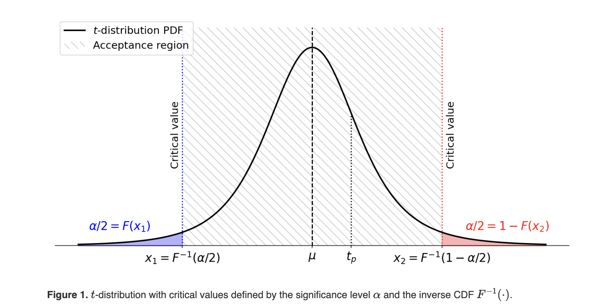

```{r, echo=F,eval=T,message=F,warning=F}
invisible(pacman::p_load(ggplot2,read_xl,tidyverse,xtable,patchwork,datasets))
```

## Roadmap

In this tutorial, we are going to

1.  Do a recap on **Ordinary Least Square** estimator
2.  Learn how to run and interpret an OLS estimation in R
3.  Replicate the key results from Mankiw, Romer & Weil (1994)

::: callout-note
Disclaimer: the recap on OLS is inspired by Sciences Po's Introduction to Econometrics with R. Interested students can check the full material [here](https://scpoecon.github.io/ScPoEconometrics/).
:::

## Recap on linear regression
### Visual intuition

1.  Assess the statistical relationship between variables (not necessarily causal)
2.  In the toolbox of the social scientist, with many other empirical tools

```{r}
#| echo: true
ggplot(cars,aes(x=speed,y=dist)) +
  geom_point(color="red") +
  labs(x ="Speed", y = "Stopping distance", title = "Car speed vs. stopping distance")+
  theme_minimal() 
```

---

It seems that there is a linear relationship between these two variables

```{r}
#| echo: true
ggplot(cars,aes(x=speed,y=dist)) +
  geom_point(color="red") +
  geom_abline(intercept=10,slope=2.5,color="blue") +
  labs(x ="Speed", y = "Stopping distance", title = "Car speed vs. stopping distance")+
  theme_minimal() 
```

---

There are a priori many ways to have a better "fit" (smaller distance between observed and predicted distances)

```{r}
#| echo: true
ggplot(cars, aes(x = speed, y = dist)) +
  geom_point(color = "black") +
  geom_abline(intercept = 5, slope = 2.5, color = "blue") +
  geom_segment(aes(x = speed, 
                   y = dist, 
                   xend = speed, 
                   yend = 5 + 2.5 * speed), 
               arrow = arrow(length = unit(0.1, "inches")), 
               color = "red") +
  labs(x ="Speed", y = "Stopping distance", title = "Car speed vs. stopping distance")+
  theme_minimal() 
```

---

### OLS estimator

-   Minimizes the sum of squared distances ($\sim$ error), thus the name "ordinary least square"

-   An affine function is defined as $y = \beta_0 + \beta_1 x$ which in matrix form gives $Y = X\beta$.

-   Dimension of $X$?

-   The error for each observation is $\epsilon_i = y_i - \beta_0 - \beta_1 x_i$

-   Hence, we look for $\hat{\beta}$ to minimize:
 $$\min_\beta (Y - X\beta)'(Y - X\beta) = \min_\beta \epsilon'\epsilon $$

-   The OLS estimator is then: 
$$  \hat{\beta} = (X'X)^{-1}X'y $$

-   **Question**: Derive $\hat{\beta}$ from the problem's first order condition

---

### Gauss-Markov 

Under the following assumptions: 

-   1. Linearity of the "true" model $y = x'\beta + \epsilon$
-   2. Observed sample $(y_i,x_i)_{i= 1...n}$ is a random sample with the same distribution as $(y,x)$
-   3. No perfect collinearity between the covariates in the sample (and in the population)
-   4. Zero conditional mean $E(\epsilon|x) =0$
-   5. Homoskedasticity $Var(\epsilon|x_1,...,x_n) = \sigma^2$ 

The OLS estimator is BLUE: best linear unbiased estimator

-   Linear estimator: $\hat{\beta}_j = \sum\limits_1^n w_{ij} y_i$, $w_{ij}$ functions of $x_1,...x_n$
-   Unbiased: $E(\hat{\beta}|x_1,...,x_n) = \beta$
-   "Best": smallest variance of all linear unbiased estimators, conditional on observed $x_1,...x_n$

::: callout-tip
Only Assumptions 1-4 are needed for unbiasedness
:::

---

### Failures of assumptions: linearity

Francis Anscombe created four datasets with identical linear statistics: mean, variance, correlation and regression line are identical. Their data generating processes are however very different

```{r}
g1 = ggplot(datasets::anscombe,aes(x=x1,y=y1)) +
  geom_point(color="black") +
  geom_smooth(method = "lm",se=F) +
  coord_cartesian(xlim = c(3,20))+
  theme_minimal() +
  xlab("X") + ylab("Y") + ggtitle("Q1")
g2 = ggplot(datasets::anscombe,aes(x=x2,y=y2)) +
  geom_point(color="black") +
  geom_smooth(method = "lm",se=F) +
  coord_cartesian(xlim = c(3,20))+
  theme_minimal() +
  xlab("X") + ylab("Y") + ggtitle("Q2")
g3 = ggplot(datasets::anscombe,aes(x=x3,y=y3)) +
  geom_point(color="black") +
  geom_smooth(method = "lm",se=F) +
  coord_cartesian(xlim = c(3,20))+
  theme_minimal() +
  xlab("X") + ylab("Y") + ggtitle("Q3")
g4 = ggplot(datasets::anscombe,aes(x=x4,y=y4)) +
  geom_point(color="black") +
  geom_smooth(method = "lm",se=F) +
  coord_cartesian(xlim = c(3,20))+
  theme_minimal() +
  xlab("X") + ylab("Y") + ggtitle("Q4")

(g1 | g2) /
(g3 | g4)
```

---

### Failures of assumptions: endogeneity

Assumption **3** might not hold for various reasons: 

-   1. Measurement error: We measure $\tilde{x} = x +u$ instead of $x$. Example? 
-   2. Omitted variable in the model correlated with $x$. Example?
-   3. Simultaneity: $x$ and $y$ are determined simulatenously and endogenously. Example?

In all these cases, we might have $E(X|\epsilon) \neq 0$ and a biased estimator $E(\hat{\beta}) \neq \beta$. 

-----

### Omitted variable bias

Consider the true model: $Y = \beta_0 + \beta_1 X_1 + \beta_2 X_2 + \epsilon$, $E[\epsilon | X_1, X_2] = 0$. Suppose $X_2$ is omitted from the regression. The estimated model is:

$$
Y = \alpha_0 + \alpha_1 X_1 + u
$$

where the new error term $u$ is: $u = \beta_2 X_2 + \epsilon$. Since $X_2$ is omitted, we express it in terms of $X_1$ using the linear projection:

$$
X_2 = \gamma_0 + \gamma_1 X_1 + v
$$

where $v$ is the residual such that $E[v | X_1] = 0$. Substituting into the true model:

$$
u = \beta_2 \gamma_0 + \beta_2 \gamma_1 X_1 + \beta_2 v + \epsilon
$$

Since $u$ is correlated with $X_1$, the OLS estimator for $\alpha_1$ is defined by:

$$
\hat{\alpha}_1 = \frac{Cov(Y, X_1)}{Var(X_1)}
$$

---

Substituting $Y$ from the true model:

$$
\hat{\alpha}_1 = \frac{Cov(\beta_0 + \beta_1 X_1 + \beta_2 X_2 + \epsilon, X_1)}{Var(X_1)}
$$

Expanding covariance terms:

$$
\hat{\alpha}_1 = \beta_1 + \beta_2 \frac{Cov(X_2, X_1)}{Var(X_1)}
$$

Using the projection equation:

$$
\hat{\alpha}_1 = \beta_1 + \beta_2 \gamma_1
$$

Since $\gamma_1 \neq 0$ if $X_1$ and $X_2$ are correlated, and $\beta_2 \neq 0$ if $X_2$ is relevant, it follows that:

$$
E[\hat{\alpha}_1] \neq \beta_1
$$


---

## Example of OLS regression in R
### lm function

The main R function for OLS regression is `lm`. For linear model, the syntax is `lm(y ~ x)`. It yields

```{r, echo=T}
summary(lm(cars$dist ~ cars$speed))
```

-   Summary statistics on the residuals
-   Estimated parameters, their standard errors and **t-value**
-   R-squared

--- 

### P-value and hypothesis testing

Assuming Gauss-Markov assumptions hold, the OLS estimator has the following Normal distribution: 

$$
\frac{\hat{\beta}-\beta}{\sqrt{\sigma^2 (X' X)^{-1}}} \tilde{} N\left(0, 1\right)
$$

-   Unfortunately, we will never know $\sigma^2$, the variance of the error term. Instead we have the empirical estimator of this t-statistic. 

$$
\frac{\hat{\beta}-\beta}{se(\hat{\beta})} \tilde{} t(N−k)
$$

-   It can be showed that this statistic follows a Student law at $N-k$ degrees of freedom, with cumulative distribution $F$, where $N$ is the number of observations and $k$ the number of covariates.
-   For very large $N$, this distribution is very close to the standard normal distribution.


---

-   A standard hypothesis to test for the significance of estimated parameters is $H_0: \beta_k = 0$. 
-   The summary of the lm function yields the t-stat $t$ assuming $\beta_k =0$. 
-   It can be rejected with 95\% confidence if the estimated parameter is "far enough" from zero ($p(t) < 0.05$), that is: 

$$
\left|\frac{\hat{\beta_k}-0}{se(\hat{\beta_k})}\right| > F^{-1}(0.05/2) \approx 1.96
$$

{width=40% fig-align="center"}


---

### R-squared

The sample variance of $y$ (SST - sum of squares total) can be decomposed into the explained (SSR - sum of squares regression) and residual variances (SSE - sum of squares errors): 

$$
\frac{1}{n-1}\sum\limits_{i=1}^n (y_i-\overline{y})^2 = \frac{1}{n-1}\sum\limits_{i=1}^n (\hat{y}_i-\overline{y})^2 + \frac{1}{n-1}\sum\limits_{i=1}^n (\hat{u}_i)^2
$$


The R-squared is the share of the variance explained by the model: 
$$
R^2 = \frac{SSR}{SST} = 1- \frac{SSE }{ SST}
$$

::: callout-tip
Proof comes from expanding 

$$
(y_i- \overline{y} )^2 = ((y_i- \hat{y}_i)+(\hat{y}_i - \overline{y}))^2 
$$

Noticing $y_i-\hat{y}_i= \hat{u}_i$, 
And $\hat{y}_i -\overline{y} = \hat{\beta}_1(x_i - \overline{x})$.

:::

---

## Exercise: Replication of Mankiw, Romer & Weil (1994)
### The model

Recall that the Solow model assumes the following GDP production function: 
$$
Y(t) = K(t)^{\alpha} (L(t)A(t))^{1-\alpha}, 0<\alpha<1
$$

In continuous time, exogenous and constant population and technology growth can be modelled by:

$$
L(t) = L(0)e^{nt}
$$

$$
A(t) = A(0)e^{gt}
$$

Mankiw et al. (1994) asks: is the Solow model compatible with the data?

---

### Log-linearization

Recall from the class that output per effective unit reaches a steady state: 

$$
\frac{Y_t}{A_tL_t} = \left(\frac{s}{n+g+\delta}\right)^{\frac{\alpha}{1-\alpha}}
$$

**Main issue** for empirical estimation: the model is not linear. However, taking the logs yields: 

$$
\ln\left(\frac{Y_t}{L_t}\right)  = \ln(A_t) + \frac{\alpha}{1-\alpha} \ln(s) - \frac{\alpha}{1-\alpha} \ln(n+g+\delta)
$$

The authors write as $\ln(A_t) = \ln(A(0))+ gt = a + gt + \epsilon$, where $\epsilon$ is a "country-specific shock", which allows for OLS estimation: 

$$
\ln\left(\frac{Y_t}{L_t}\right)  = \beta_0 + \beta_1 \ln(s) + \beta_2 \ln(n+g+\delta) +\epsilon
$$

::: callout-tip
Strong assumptions for estimation: $n$ and $s$ independent of $\epsilon$. $g+\delta =0.05$ whatever the country. Discuss...
:::

---

### Loading, describing, cleaning the data

-   1. Download the "MRW_QJE1992" data from Moodle. Load it in R, as well as usual packages.
-   2. Describe the data. Check that the three country groups "n", "i", "o" are nested
-   3. Compute summary statistics by group for the GDP growth and GDP per capita in 1985. How do countries differ across groups?
The paper performs separate analysis for each group. Why?
-   4. Restrict the sample to non-missing groups. Build useful variables for the OLS regression. 
-   5. Plot log of GDP per capita vs growth rate of GDP, log saving rate. What do you think of an analysis restricting the sample to group "o"?

---

### Estimates and interpretation

-  6. Run the model on the full sample and on each sub-group using "lm". Store the results in appropriate objects.
-  7. Interpret the results in the light of the Solow model predictions. What is the share of cross-country income per capita variation is explained by the model?
-  8. In previous work, the share of capital in production was thought to be roughly 1/3, is this prediction supported by the data?
-  9. [Bonus] We assumed that $\beta_2 = - \beta_1$. The Fisher test allows to test if we can reject this hypothesis, using linearHypothesis() from the package car. 
-  10. Discuss the specification: what reasons would Assumption 4 not hold?

---

### Augmented model

Mankiw et al. focuses on an **omitted variable** of the baseline Solow model: human capital (half of total capital in the US in 1976). The authors assume an alternative production function: 

$$
Y(t) = K(t)^{\alpha}H(t)^\beta (L(t)A(t))^{1-\alpha-\beta}, 0<\alpha + \beta<1
$$

Human capital accumulates in the same way (same cost of one unit of consumption) at saving rate $s_h$ and depreciates at same rate $\delta$. That implies at the steady state per effective unit:

$$
k^* = \left(\frac{s_k^{1-\beta} s_h^\beta}{n+g+\delta}\right)^{\frac{1}{1-\alpha - \beta}}
$$

$$
h^* = \left(\frac{s_k^\alpha s_h^{1-\alpha}}{n+g+\delta}\right)^{\frac{1}{1-\alpha - \beta}}
$$

And after log linearizing output per effective unit (show it!): 

$$
\ln\left(\frac{Y_t}{L_t}\right)  = \ln(A_0)+gt + \frac{\alpha}{1-\alpha-\beta} \ln(s_k) - \frac{\alpha+\beta}{1-\alpha-\beta} \ln(n+g+\delta) +\frac{\beta}{1-\alpha-\beta} \ln(s_h)
$$

---

-   11. In the empirical specification, $s_h$ is the share of the working age population enrolled in education. Why?
-   12. Run the augmented regression. Interpret the coefficients and implied $\alpha$, $\beta$. 
-   13. From what we have seen before on omitted variable bias, and the previous biased results, what do you think is the sign of $cov(s_h,s_k)$? 
-   14. Export the results in latex using stargazer, and into a pdf using Overleaf

